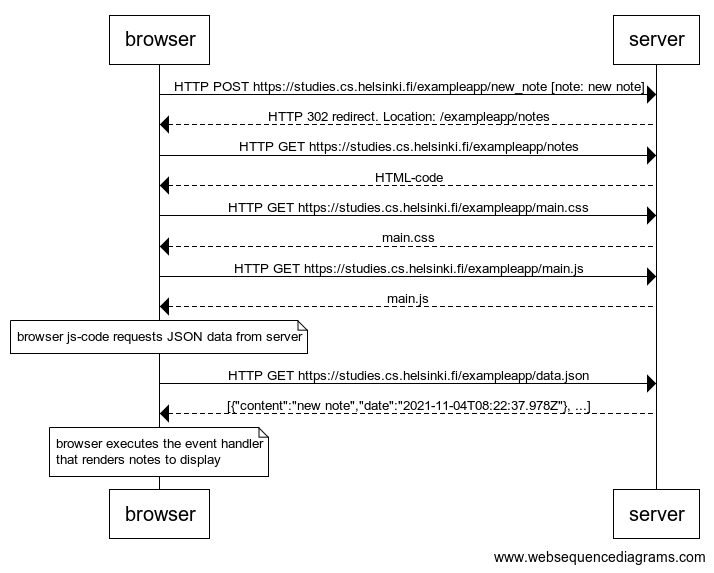

# Part0

## Exercise 0.4

Create a diagram where the user creates a new note on page [https://studies.cs.helsinki.fi/exampleapp/new_note](https://studies.cs.helsinki.fi/exampleapp/new_note)

```
browser->server: HTTP POST https://studies.cs.helsinki.fi/exampleapp/new_note [note: new note]
server-->browser: HTTP 302 redirect. Location: /exampleapp/notes
browser->server: HTTP GET https://studies.cs.helsinki.fi/exampleapp/notes
server-->browser: HTML-code
browser->server: HTTP GET https://studies.cs.helsinki.fi/exampleapp/main.css
server-->browser: main.css
browser->server: HTTP GET https://studies.cs.helsinki.fi/exampleapp/main.js
server-->browser: main.js

note over browser:
browser js-code requests JSON data from server 
end note

browser->server: HTTP GET https://studies.cs.helsinki.fi/exampleapp/data.json
server-->browser: [{"content":"new note","date":"2021-11-04T08:22:37.978Z"}, ...]

note over browser:
browser executes the event handler
that renders notes to display
end note
```


